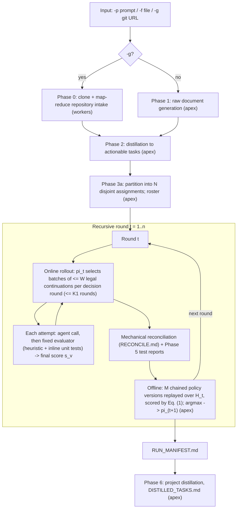

# `autoresearch-rsi-onefile.py`: A Technical HOWTO

**Recursive self-improvement at the exploration layer on a local multi-tier inference cluster**

*ThereminQ / thereminq-autoresearch. Technical documentation, revision of 2026-09-19 (paper-aligned release).*

---

## Abstract

This document is an operational and technical description of `autoresearch-rsi-onefile.py`, a single-file orchestration pipeline. The pipeline turns a natural-language prompt, a prompt file, or a Git repository into a partitioned set of agent assignments. A team of language-model agents on a local inference cluster then executes those assignments over several recursive rounds. The central mechanism follows the Dream-RSI framework of Zheng et al. [1]:

- An exploration policy, represented as executable code, acts in **decision rounds**. In each round it selects a batch of at most $W$ legal continuations of the discovery tree, and it stops by submitting no further batch.
- A **fixed evaluator** scores each attempt once, at creation. This includes unit tests generated and executed for the attempt's deliverables.
- Each online rollout is recorded as a discovery tree. The accumulated trees serve as a replay simulator in which policy versions are evaluated at zero agent-call cost ("dreaming"), using the replay objective of [1, Eq. 1].
- A policy-development agent derives a chain of revisions, each from its predecessor's replay trajectories and scores. The argmax over all versions is redeployed in the next round.

We describe the system architecture, all command-line options and environment variables, the per-phase workflow, the evaluator and replay objective, and the policy programming interface with its sandbox. We also cover inter-agent communication, the on-disk artefact layout, and standard operating procedures. We conclude with a precise account of how this implementation maps onto the formalism of [1], and of the few adaptations that its multi-assignment setting requires.

---

## Contents

1. [Introduction and scope](#1-introduction-and-scope)
2. [Background: exploration-layer RSI](#2-background-exploration-layer-rsi)
3. [System architecture](#3-system-architecture)
4. [Installation and cluster deployment](#4-installation-and-cluster-deployment)
5. [Command-line interface](#5-command-line-interface)
6. [Configuration by environment variables](#6-configuration-by-environment-variables)
7. [Workflow: phase-by-phase](#7-workflow-phase-by-phase)
8. [Evaluator and replay objective](#8-evaluator-and-replay-objective)
9. [Writing exploration policies](#9-writing-exploration-policies)
10. [Inter-agent communication](#10-inter-agent-communication)
11. [Run directory layout](#11-run-directory-layout)
12. [Standard operating procedures](#12-standard-operating-procedures)
13. [Correspondence with Dream-RSI](#13-correspondence-with-dream-rsi)
14. [Security model](#14-security-model)
15. [Diagnostics and troubleshooting](#15-diagnostics-and-troubleshooting)
16. [Known limitations](#16-known-limitations)
17. [References](#references)
18. [Appendices](#appendix-a-node-record-schema)

---

## 1. Introduction and scope

### 1.1 Problem setting

Long-horizon, agent-driven discovery spends most of its compute on proposal–evaluation cycles. How those cycles are allocated is decided by the *exploration strategy*: which branches to open, which to refine, what to run in parallel, and when to stop. Zheng et al. [1] identify two obstacles to improving that strategy:

- **Delayed feedback.** A strategy's quality is only observable after a long rollout.
- **A large meta-search space.** Many candidate strategies may need to be tried.

Their proposal is to treat completed discovery histories as a replay simulator. Alternative strategies can then be scored against recorded outcomes without re-invoking the discovery agent or the evaluator. This is analogous to model-based reinforcement learning and world models [2–6].

### 1.2 What this script is

`autoresearch-rsi-onefile.py` (a single Python module of about 4,800 lines) implements that loop for a multi-agent research-and-build pipeline running on self-hosted, OpenAI-compatible inference servers (e.g. `llama-server` from llama.cpp [13]). It has five properties.

1. **The unit of exploration is an agent assignment.** A planning model partitions the input into mutually exclusive assignments $t_{01},\dots,t_{N}$ ($3 \le N \le 20$). Each assignment is an independent discovery problem. All assignments share the root of one discovery tree per round.
2. **One online attempt is one agent call plus its evaluation.** The attempt writes real files into an agent-owned directory. The fixed evaluator scores it, and it becomes a tree node carrying its realized outcome.
3. **Exploration follows the decision-round interface of [1, §3].** Legal continuations are the root (a new branch) and the current leaves. A batch holds at most $W$ of them. Rollouts are capped at $K_1$ decision rounds online and $K_2$ in replay.
4. **Only the exploration policy is improved.** The models, prompts, evaluator and execution interfaces are fixed [1, §3].
5. **Policy improvement follows [1, §3].** $M$ chained policy versions are replayed on the fixed history, scored by Eq. (1) with its cost and parallelism terms, and the argmax is deployed.

### 1.3 Status of the reference implementation

The Dream-RSI paper is available as arXiv:2609.14858 [1]. At the time of writing, the official repository `zhengkid/Dream-RSI` [14] contains the paper, the project assets and a citation file. Its release plan lists the full codebase, the discovered programs and the reproduction scripts as "being prepared". Consequently:

- this script is an **independent implementation** of the formalism in §3 of [1];
- it is not a port of released code;
- it adopts the parts of the published prompts (Appendix B of [1]) that concern the policy interface: legal-action lists, the maximum batch size, prefix-only decisions, and per-round execution traces as between-version feedback;
- §13 lists the correspondence element by element, together with the adaptations that remain.

---

## 2. Background: exploration-layer RSI

We briefly restate the formalism of [1, §3] in the notation used throughout.

**Discovery tree.** A rollout grows a rooted tree $\mathcal{T}$. Each non-root node $v$ records a single attempt: its parent, the resulting workspace/artefacts, diagnostics, and a score $s_v$ (larger is better). The atomic action $\textsc{Continue}(v)$ resumes the workspace of $v$ and produces one new evaluated child. Continuing from the root opens a new branch.

**Policy and batches.** With $W$ parallel workers, a policy selects at each decision round a batch $C$ of at most $W$ eligible nodes. The empty batch terminates the rollout.

**Online rollout.** At outer iteration $t$, policy $\pi_t$ is deployed and produces $\mathcal{T}_t$. The history grows to $\mathcal{H}_t = (\mathcal{T}_1,\dots,\mathcal{T}_t)$.

**Replay.** A candidate policy is replayed from the root of each recorded $\mathcal{T}_i$. Selecting $v$ deterministically reveals the recorded child of $v$, if any. The policy sees only the revealed prefix.

**Replay objective** [1, Eq. 1]:

$$
V_i^m \;=\; \max_{v \in \hat{\mathcal{T}}_i^{m}} s_v \;-\; \beta_1 N_i^m \;+\; \beta_2 \frac{N_i^m}{\max\{1,k_i^{m,\star}\}},
$$

where $N_i^m$ is the number of revealed non-root nodes and $k_i^{m,\star}$ the number of decision rounds.

**Selection.** The policy-development agent writes revisions $\pi_t^1,\dots,\pi_t^{M-1}$. The next policy is $\pi_{t+1} = \arg\max_m \tfrac{1}{t}\sum_i V_i^m$. Revision $\pi_t^{m+1}$ is derived from $\pi_t^m$, using its replay trajectories and scores together with the feedback of earlier revisions. Because $\pi_t^0 = \pi_t$ is itself a candidate, the selected policy is never worse than the deployed one in average replay score on $\mathcal{H}_t$.

Section 13 details how each of these elements is realized, and where the script departs from the formalism.

---

## 3. System architecture

### 3.1 Inference tiers

The script addresses two tiers of OpenAI-compatible chat-completion endpoints. There is deliberately **no third "stitcher" tier**: no model ever merges the outputs of multiple agents. Consolidation is mechanical (a filesystem walk plus content hashing, §7.7).

| Tier | Endpoint variable(s) | Default | Used for |
|---|---|---|---|
| **Apex** (planning) | `OPENAI_API_BASE`, `LLM_MODEL`; `DISTILLER_URL`, `DISTILLER_MODEL` | `http://localhost:9931/v1` | Phase 1 generation, Phase 2 distillation, Phase 3 partitioning, policy development (dreaming), Phase 6 distillation |
| **Workers** (agents) | `WORKER_ENDPOINTS`, `WORKER_MODEL` | `http://localhost:8030/v1` … `:8035/v1` | Every agent assignment (online rounds), Phase 0 repository map-reduce, evaluator test generation |

The apex tier is assumed to be single-slot (`APEX_SERVER_NP=1`) and is therefore used strictly serially. Each worker endpoint contributes `WORKER_PARALLEL_SLOTS` concurrent slots to a shared slot queue. The number of parallel workers $W$, i.e. the maximum batch size of one decision round, defaults to

$$W = |\texttt{WORKER\_ENDPOINTS}| \times \texttt{WORKER\_PARALLEL\_SLOTS}$$

and can be overridden with `MAX_PARALLELISM`. The same $W$ applies in replay.

> **Note on port numbers.** The apex defaults to port 9931 and the workers to ports 8030–8035. Apex-related error messages print the configured `OPENAI_API_BASE`. If your `start-*.sh` launch script uses other hosts or ports, set `OPENAI_API_BASE` and `WORKER_ENDPOINTS` explicitly (§4.2).

### 3.2 Phase structure



### 3.3 Separation of concerns

The design rests on four invariants. The rest of the code is organized to preserve them.

1. **Identical policy surface.** The same policy source runs unchanged against `LiveExplorer` (real agent calls) and `ReplayExplorer` (recorded nodes, no calls). Both enforce the same decision-round and legality rules. This identity is what makes dreaming meaningful.
2. **A single, final score per node.** The evaluator is applied once, at creation, and its score is never rewritten. The online policy decides on exactly the value that replay later reveals, so replay is exact on recorded branches.
3. **Budget in one currency.** One unit equals one discovery-agent call, and retries are charged. The currency is identical online and in replay. Evaluator calls (test generation) are not discovery-agent calls and are not charged, as in [1], where the evaluator is outside the discovery budget.
4. **Ownership.** Every agent writes only into its own directory. Cross-agent paths are quarantined as violations (§7.5).

---

## 4. Installation and cluster deployment

### 4.1 Host requirements

| Requirement | Reason |
|---|---|
| Linux (POSIX) | `resource.setrlimit`, `os.killpg`, `ulimit` and process groups are used by the policy sandbox and the test runner. |
| Python ≥ 3.9 | `ThreadPoolExecutor.shutdown(cancel_futures=True)`, modern typing. |
| `openai` (Python SDK), `requests` | Chat completions (streaming) and Phase 5 raw HTTP calls. |
| `git` on `PATH` | Phase 0 (`-g`). |
| `gcc`, `g++` | Phase 5 C/C++ tests. |
| `pytest` (host or venv) | Phase 5 Python tests. The script creates `tests/.venv` with `--system-site-packages` and installs `pytest` from binary wheels if it is missing. |
| `bash` | Phase 5 shell tests and the `ulimit` wrapper. |

```bash
python3 -m pip install openai requests pytest
```

### 4.2 Server context alignment

The script's token budgets must mirror the `-c` and `-np` flags of the inference servers. For `llama-server` with a unified KV cache (`--kv-unified`), `-c N` is the **total** KV budget of the process, shared across the `-np` slots. The concurrency-safe per-request window is therefore $\lfloor N / n_p \rfloor$. The script computes

$$
\texttt{APEX\_CONTEXT\_TOKENS} = \max\!\big(4096,\ \lfloor \texttt{APEX\_SERVER\_CTX} / \texttt{APEX\_SERVER\_NP} \rfloor\big),
$$
$$
\texttt{WORKER\_CONTEXT\_TOKENS} = \max\!\big(4096,\ \lfloor \texttt{WORKER\_SERVER\_CTX} / \texttt{WORKER\_SERVER\_NP} \rfloor\big).
$$

If the worker pool is heterogeneous in `-c`, set `WORKER_SERVER_CTX` to the **smallest** node's value. Otherwise the larger nodes' budgets will silently over-subscribe the smaller ones.

A minimal launch sketch (adapt model paths, ports and GPU layers to your hardware; building llama.cpp with its Vulkan backend avoids a vendor-specific GPU stack):

```bash
# Apex: single slot, 64k total context
llama-server -m apex.gguf --port 9931 -c 65536 -np 1 &

# Workers: two slots each, unified KV, 192k total context per process (96k per slot)
for p in 8030 8031 8032 8033 8034 8035; do
  llama-server -m worker.gguf --port $p -c 196608 -np 2 --kv-unified &
done
```

At start-up the script performs two checks:

- **`verify_server_props`** queries `GET /props` on every endpoint and reports each as `ok`, `UNDER-PROVISIONED`, `larger than budget` or `MISMATCH`.
- **`ping_tier`** sends a four-token smoke completion. **Every** worker endpoint must pass, otherwise the run aborts. If the apex fails, only apex-dependent phases are refused.

### 4.3 Budget alignment report

`describe_budget_alignment()` prints a `[BUDGET]` block at start-up: per-request windows, the agent input sub-budgets, the output ceiling, and the RSI settings. Read it before every new deployment. It prints two warnings that indicate misconfiguration:

- `[!] Agent sub-budgets total … exceeds the input window`
- `[!] WARNING: Calculated agent output budget collapsed to … and hit the 1024 floor`

The latter means that most agent deliverables will be truncated.

---

## 5. Command-line interface

```
autoresearch-rsi-onefile.py  (-p PROMPT | -f FILE | -g GIT_URL | -r)
                             [--focus TEXT] [--git-path PATH]
                             [-d DIR] [-c CATEGORY]
                             [-n ROUNDS] [--budget CALLS]
                             [--no-dream | --dream-only] [--semantic-guidance]
                             [--iterate]
```

| Option | Type / default | Semantics |
|---|---|---|
| `-p`, `--prompt` | str | Direct prompt. Triggers Phase 1 (apex generation). Mutually exclusive with `-f`, `-g`. |
| `-f`, `--file` | path | Prompt read from a text file (non-ASCII stripped). Triggers Phase 1. |
| `-g`, `--git` | URL | Git repository as input. Triggers Phase 0 instead of Phase 1. The URL must match an `https`, `http`, `ssh`, `git@` or `git://` pattern and must not resolve to a private address unless `GIT_ALLOW_PRIVATE_HOSTS=1`. |
| `--focus` | str, `""` | Analysis focus appended to the Phase 0 summarize/reduce prompts. Requires `-g`. |
| `--git-path` | str, `""` | Restrict Phase 0 ingestion to one file or subdirectory of the repository. Requires `-g`. |
| `-d`, `--dir` | path, `run_data` | Base output directory. |
| `-c`, `--category` | str, `projects` | Category sub-folder. Runs are created as `<dir>/<category>/run_<YYYYmmdd_HHMMSS>_<hex6>/`. |
| `-r`, `--resume` | flag | Bind to the **most recently modified** `run_*` directory in the category that contains at least one `.md` file, and continue from the furthest completed artefact. Cannot be combined with `-p`, `-f`, `-g`. |
| `-n`, `--rounds` | int, `RSI_ROUNDS` (1) | Total number of recursive rounds, $1 \le n \le$ `RSI_MAX_ROUNDS` (12). On resume, rounds already completed count towards $n$. To run one more round after three, pass `-r -n 4`. |
| `--budget` | int, `0` (auto) | Discovery-agent calls per round (the per-round resource cap). If the optional support-probe extension is enabled, this includes its reserve. `0` selects the roster-scaled default (§7.4). |
| `--no-dream` | flag | Disable offline policy improvement. Every round redeploys the hand-written $\pi_0$. This is the *Recursive Fixed Exploration* control of [1, §4], at the same per-round budget. |
| `--dream-only` | flag | Run no agents. Dream over the existing tree pool of a resumed run and write the next policy file. Requires `-r` and at least one recorded round. Only the apex tier must be reachable. Contradicts `--no-dream`. |
| `--semantic-guidance` | flag | Inject a fixed "directional guidance" section into every agent's communication digest. Off by default: it exists only to reproduce the negative ablation of [1, §5.1] (Fig. 5), in which prompt-level directional guidance underperformed unguided replay at equal budget. |
| `--iterate` | flag | Phase 6 refines an existing `DISTILLED_TASKS.md` instead of skipping it on resume. |

Argument validation is strict. For example, `--focus` without `-g`, `--dream-only` without `-r`, or `-n 13` are rejected by `argparse` before any network activity.

---

## 6. Configuration by environment variables

All tunables are read once at import time via `os.getenv`. Values are given with their coded defaults.

### 6.1 Endpoints and models

| Variable | Default | Meaning |
|---|---|---|
| `OPENAI_API_BASE` | `http://localhost:9931/v1` | Apex base URL (Phases 1, 3a, dreaming). |
| `OPENAI_API_KEY` | `sk-local` | Apex API key. |
| `LLM_MODEL` | `Qwen3.8-Flash-Next-UD-IQ4_XS` | Apex model name. |
| `DISTILLER_URL` | `http://localhost:9931/v1` | Endpoint for Phase 2 and Phase 6 distillation. |
| `DISTILLER_MODEL` | `Qwen3.8-Flash-Next-UD-IQ4_XS` | Distillation model. |
| `DISTILLER_API_KEY` | `local-sk` | Distillation API key. |
| `WORKER_ENDPOINTS` | `http://localhost:8030/v1,…,:8035/v1` | Comma-separated worker base URLs. |
| `WORKER_MODEL` | `Qwen3.8-9B-Q4_K_M.gguf` | Worker model name. |
| `WORKER_API_KEY` | `local-sk` | Worker API key. |

### 6.2 Server geometry and context budgets

| Variable | Default | Meaning |
|---|---|---|
| `APEX_SERVER_CTX` / `APEX_SERVER_NP` | `65536` / `1` | Mirror of apex `-c` / `-np`. |
| `WORKER_SERVER_CTX` / `WORKER_SERVER_NP` | `196608` / `2` | Mirror of worker `-c` / `-np` (smallest node if heterogeneous). Per-slot window: 98,304 tokens. |
| `WORKER_PARALLEL_SLOTS` | `= WORKER_SERVER_NP` | Slots used per worker, clamped to `WORKER_SERVER_NP`. |
| `CHARS_PER_TOKEN` | `3.5` | Character-to-token conversion used for all budgets. |
| `APEX_MAX_OUTPUT_TOKENS` | `8192` | Ceiling for apex outputs. |
| `APEX_GEN_TOKENS` | `4096` | Phase 1 generation length. |
| `APEX_PLAN_TOKENS` | `4096` | Phase 3a partition output (a JSON array). |
| `APEX_DISTILL_TOKENS` | `8192` | Phase 2/6 distillation output. |
| `APEX_POLICY_TOKENS` | `4096` | One policy revision. |
| `APEX_RESERVE_TOKENS` | `2048` | Safety margin in the apex window. |
| `MAX_CONTEXT_CHARS` | `60000` (clamped) | Apex input ceiling in characters. |
| `MAX_CHUNK_CHARS` | `40000` (clamped) | Chunk size for Phase 0 batching and splitting. |
| `WORKER_INPUT_CHARS` | `90000` (clamped) | Total agent prompt size in characters. |
| `MAX_WORKER_TOKENS` | `8192` (clamped, ≥ 1024) | Agent output ceiling. |
| `WORKER_RESERVE_TOKENS` | `2048` | Safety margin in the worker window. |
| `WORKER_TIMEOUT_SECS` | `300` | Per-request client timeout. |
| `WORKER_MIN_DECODE_TPS` | `4.0` | Used to derive `WORKER_MAX_WALL_SECS` = max(600, `MAX_WORKER_TOKENS`/tps + 120). |
| `MAX_DECOMPOSE_TASKS` | `20` | Upper bound on roster size $N$. |

### 6.3 Agent prompt sub-budgets

The agent input window `WORKER_INPUT_CHARS` is split into four hard sub-budgets, so that no single section can starve the others:

| Variable | Default share | Section |
|---|---|---|
| `AGENT_CONTEXT_BUDGET` | 35 % | Broader context (the distilled task list), orientation only |
| `AGENT_ROSTER_BUDGET` | 15 % | Team roster rendered as explicit exclusions |
| `AGENT_COMMS_BUDGET` | 35 % | Team communication digest (§10) |
| `AGENT_OBJECTIVE_BUDGET` | 15 % | The agent's own objective |
| `AGENT_PARENT_BUDGET` | 70 % of context | For continuations: inherited deliverables, carved *out of* the context budget |
| `COMMS_PEER_SUMMARY_CHARS` | `700` | Truncation length per teammate log in the digest |

### 6.4 Recursive self-improvement

| Variable | Default | Meaning |
|---|---|---|
| `RSI_ROUNDS` | `1` | Default for `-n` (outer iterations $t$). |
| `RSI_MAX_ROUNDS` | `12` | Upper bound for `-n`. |
| `ROUND_BUDGET_PER_TASK` | `2.0` | Auto budget = round($N$ × this), clamped to [`ROUND_BUDGET_MIN`, `ROUND_BUDGET_MAX`]. |
| `ROUND_BUDGET_MIN` / `ROUND_BUDGET_MAX` | `3` / `60` | Clamp for the auto budget. |
| `MAX_PARALLELISM` | endpoints × slots | $W$: the maximum batch size of one decision round, online and in replay. |
| `ONLINE_MAX_DECISION_ROUNDS` | `32` | $K_1$: decision-round cap of an online rollout. |
| `REPLAY_MAX_DECISION_ROUNDS` | $= K_1$ | $K_2$: decision-round cap of a replay. |
| `DREAM_CANDIDATES` | `3` | $M-1$: chained revisions per offline phase. $M$ = this + 1 versions are evaluated. |
| `DREAM_BETA1` | `0.002` | $\beta_1$: cost per revealed node in Eq. (1). |
| `DREAM_BETA2` | `0.004` | $\beta_2$: weight of the parallelism bonus $N/\max(1,k^\star)$ in Eq. (1). |
| `DREAM_TRACE_CHARS` | `6000` | Size of the per-round replay trajectory digest given to the policy-development agent. |
| `SUPPORT_PROBE_FRAC` | `0.0` | *Extension, off by default.* Fraction of each round's budget reserved for off-policy support probes (§7.6). |

### 6.5 Evaluator

| Variable | Default | Role (§8.1–8.2) |
|---|---|---|
| `EVAL_W_STATUS` | `0.35` | Weight for a successful status |
| `EVAL_PARTIAL_STATUS_FRAC` | `0.5` | Fraction of status credit for a salvaged, truncated output |
| `EVAL_W_FILES` | `0.25` | Weight for having at least one deliverable |
| `EVAL_W_LOG` | `0.15` | Weight for a `<log>` (full credit at ≥ 200 chars, half credit if shorter) |
| `EVAL_W_NOVELTY` | `0.25` | Weight × fraction of emitted files whose content hash is new |
| `EVAL_W_VIOLATION` | `0.20` | Penalty per violation (at most 3 counted) |
| `EVAL_W_TRUNCATED` | `0.15` | Penalty for truncation |
| `EVAL_HEURISTIC_MIX` | `0.6` | $\alpha$: heuristic share of the evaluator score |
| `EVAL_INLINE_TESTS` | `1` | Generate and execute unit tests for every attempt as part of its evaluation |
| `EVAL_MAX_TEST_FILES` | `6` | At most this many testable files per attempt are tested |
| `EVAL_UNTESTED_PRIOR` | `0.5` | Pass-rate term for an attempt with deliverables but no executed test |
| `RECONCILE_MIN_DUP_CHARS` | `64` | Files shorter than this (normalized) are ignored as duplicate candidates |

### 6.6 Policy sandbox

| Variable | Default | Limit |
|---|---|---|
| `POLICY_MAX_CHARS` | `20000` | Policy source length |
| `POLICY_MAX_RPC` | `4000` | *All* interface calls, reads included (safety net against polling loops) |
| `POLICY_CPU_SECS` | `20` | `RLIMIT_CPU` of the policy child process |
| `POLICY_MEM_MB` | `512` | `RLIMIT_AS` of the child |
| `POLICY_REPLAY_WALL_SECS` | `60` | Wall-clock cap per replay (live rollouts have none, because waiting on agents costs the child no CPU) |

Batch size and rollout length are governed by $W$, $K_1$ and $K_2$ (§6.4), not by sandbox limits.

### 6.7 Phase 5 (unit tests)

The unit tests are part of the evaluator (§7.8). These variables control their generation and execution.

| Variable | Default | Meaning |
|---|---|---|
| `TEST_PIP_INSTALL` | `1` | Install the sanitized `requirements*.txt` of each evaluated attempt into `tests/.venv` |
| `TEST_PIP_ALLOWLIST` | `""` | Comma list. If non-empty, only these distributions may be installed |
| `TEST_CPU_SECS` / `TEST_MEM_MB` / `TEST_FSIZE_MB` | `60` / `4096` / `128` | `ulimit` for compilation and test execution |
| `MAX_OUTPUT_TOKENS` | `4096` (clamped) | Test-generation output ceiling |
| `TEST_MIN_DECODE_TPS` | `10.0` | Derives `TEST_TIMEOUT_SECS` = max(300, `MAX_OUTPUT_TOKENS`/tps + 60) |

### 6.8 Phase 0 (Git intake)

| Variable | Default | Meaning |
|---|---|---|
| `GIT_ALLOW_PRIVATE_HOSTS` | `0` | Permit LAN hosts (e.g. self-hosted Gitea). If off, private, loopback, link-local, CGNAT and unresolvable hosts are refused. |

### 6.9 Hard-coded constants (edit the source to change)

| Constant | Value | Meaning |
|---|---|---|
| `GIT_CLONE_DEPTH` / `GIT_CLONE_TIMEOUT` | 1 / 600 s | Shallow single-branch clone |
| `REPO_MAX_FILE_BYTES` | 200,000 | Skip larger files |
| `REPO_MAX_TOTAL_CHARS` | 4,000,000 | Global ingestion cap |
| `REPO_MANIFEST_MAX_ENTRIES` | 400 | Manifest listing length |
| `REPO_SUMMARY_REDUCE_DEPTH` | 3 | Maximum recursive reduce passes |
| `MAX_RETRIES` / `WORKER_RETRIES` | 3 / 3 | Apex and agent retry counts |
| Agent sampling | T = 0.4, freq. 1.1, pres. 0.5 | `run_agent` |
| Partition / policy-dev sampling | T = 0.7 / 0.8 | Apex |
| Test-gen sampling | T = 0.1, top-p 0.95, freq. 0.5, pres. 0.2 | Phase 5 |

---

## 7. Workflow: phase-by-phase

### 7.1 Phase 0: Git repository intake (`-g`)

1. **Validation.** The URL is matched against an allowlist of URL shapes. Every resolved address of the host is checked, and resolution failure is treated as blocked (fail-closed).
2. **Clone.** `git clone --depth 1 --single-branch --no-recurse-submodules` runs with `http.followRedirects=false`, `protocol.file.allow=never`, `protocol.ext.allow=never` and `GIT_TERMINAL_PROMPT=0`. The clone goes to a temporary directory that is removed on exit (`atexit`).
3. **Collection.** Files are walked, restricted by `--git-path` if given, and filtered by extension or special filename. Vendored and build directories are excluded (`node_modules`, `vendor`, `build`, `third_party`, …), as are lockfiles, symlinks, empty files, files over 200 kB, and binaries (a NUL byte in the first 8 KiB). READMEs and manifests are ordered first, then shallow paths. Files longer than `MAX_CHUNK_CHARS` are split into numbered parts.
4. **Embedding or map-reduce.**
   - If header plus sources fit in `MAX_CONTEXT_CHARS`, the sources are embedded verbatim with language-tagged fences.
   - Otherwise the files are packed into batches of at most `MAX_CHUNK_CHARS`. The batches are summarized in parallel on the worker pool (a per-file audit prompt, optionally biased by `--focus`). The summaries are then reduced recursively (at most 3 passes). The reduction stops early if a pass compresses by less than 5 %, and the result is truncated to budget.
5. **Output.** `<timestamp>_git-repo-analysis-<name>_<hex6>.md`, containing the source URL, branch, HEAD commit, ingestion statistics and file manifest.

### 7.2 Phase 1: generation and Phase 2: distillation (apex)

- **Phase 1** (for `-p`/`-f`) streams a comprehensive Markdown document on the prompt topic (T = 0.7, `APEX_GEN_TOKENS`) into `<timestamp>_<slug>_<hex6>.md`.
- **Phase 2** reads the Phase 0 or Phase 1 document, truncated to `MAX_CONTEXT_CHARS`, and extracts only actionable TO-DOs and requirements (T = 0.3) into `<raw-stem>_distilled.md`.

The distilled document is the *query* that the rest of the pipeline works on. It also serves as every agent's "broader context".

### 7.3 Phase 3a: partitioning and roster (apex)

The partitioner prompt requires between 3 and 20 **mutually exclusive** assignments, each naming the concrete deliverable it owns. Work that must touch the same artefact is merged into one assignment. The output must be a flat JSON array of strings. It is extracted by a bracket-balanced scanner and validated. If there are more than `MAX_DECOMPOSE_TASKS` entries, the list is clamped. If three attempts fail, the whole query becomes a single assignment.

`build_roster` assigns ids `t01…tNN` and directories `tNN_<slug>` (the first four words of the objective). The roster is persisted to `comms/roster.json` and exported to `tasks/tNN.md`. On resume, the roster is **loaded, never re-planned**, so task identities stay stable across rounds, which replay requires.

### 7.4 Round budget

Let $N$ be the roster size. The per-round budget $B$ (in discovery-agent calls) is

$$
B = \operatorname{clamp}\!\big(\operatorname{round}(N \cdot \texttt{ROUND\_BUDGET\_PER\_TASK}),\ 3,\ 60\big)\quad(\text{or } \texttt{--budget}).
$$

The policy may spend $B_\pi = B - R$, where $R$ is the reserve of the optional support-probe extension:

$$
R = \max\!\big(0,\ \min(\operatorname{round}(\texttt{SUPPORT\_PROBE\_FRAC}\cdot B),\ B - N)\big).
$$

With the paper-aligned default `SUPPORT_PROBE_FRAC=0`, $R = 0$ and $B_\pi = B$. The same $B_\pi$ caps every replay during dreaming, so the online and offline budgets are aligned. The budget is a resource cap on top of the decision-round caps $K_1$/$K_2$. It mirrors the identical per-round budgets under which [1, §4] compares Dream-RSI with Recursive Fixed Exploration.

*Worked examples* (defaults):

| Roster | Budget $B$ | Policy budget $B_\pi$ |
|---|---|---|
| $N=3$ | 6 | 6 |
| $N=20$ | 40 | 40 |

### 7.5 Phase 3b: the online rollout (workers)

`run_online_round` creates a `LiveExplorer` with root node `rRRn0000`, budget $B_\pi$, batch limit $W$ and decision-round cap $K_1$. It then executes the round's policy file `policy/pi_rRR.py` in the sandbox (§9.4). If the deployed policy fails (validation error, crash or resource kill), the event is logged and $\pi_0$ continues on the **remaining** budget and decision rounds. This is a robustness measure; the stop reason records it.

**Decision rounds and legality** (after [1, §3]):

- **Legal actions.** At any moment, the legal actions are $A(\mathcal{T}) = \{(\text{root}, t) : t \in \text{roster}\} \cup \{(v, \mathrm{task}(v)) : v \text{ a leaf}\}$. A root action opens a new independent branch for assignment $t$. A leaf action continues that branch. A node that already has a child is no longer continuable, so every non-root node has at most one child.
- **Decision rounds.** One `ctx.expand_parallel(C)` call is one decision round. $C$ may hold at most $W$ distinct actions that are legal in the tree as it stood before the call. Inadmissible requests (illegal, duplicate or beyond $W$) return `None` and cost nothing. If no request is admissible, no round is consumed.
- **Termination.** The rollout ends when the policy returns (the empty batch), when $K_1$ rounds have been completed, or when the budget is exhausted.
- **Concurrency.** The admissible actions of a round run concurrently on the worker pool. The policy observes all their outcomes before its next decision.

**Anatomy of one attempt** (`LiveExplorer._run_one` → `run_agent` → `evaluate_node_inline`):

1. **Reserve.** One budget unit is reserved. Each retry (up to `WORKER_RETRIES`) reserves another unit and is refused once the budget is exhausted, so `cost` = number of real agent calls.
2. **Continuation.** For a leaf action, the leaf's deliverables are copied into the new node directory and rendered in the prompt. The agent emits only the files it changes or adds. A root action is a fresh attempt.
3. **Prompt assembly.** The prompt concatenates five sections: the **roster**, rendered as "assignments owned by other agents — do not produce these"; the **broader context**; the **team communication digest**; the **stage note**; and the **objective**. Each section is fitted to its sub-budget.
4. **Streaming call.** The worker call streams with a wall-clock guard (`WORKER_MAX_WALL_SECS`). `finish_reason == "length"` or the wall clock marks the attempt as truncated.
5. **Parsing.** A single-pass scanner splits the output into `<file path="…">`, `<log>` and `<note to="tNN">` blocks, skipping tags inside fenced or inline code:
   - **unbalanced tags** → `failed_validation`, and no files are written;
   - **truncated output with complete files** → `partial`: the complete files are salvaged;
   - **output shorter than 20 characters** → `failed_validation`.
6. **Path resolution.** Declared paths are rebuilt *inside* the node directory, so escape is impossible by construction:
   - absolute paths or `..` are recorded as violations;
   - a path naming a teammate's directory is recorded as a violation and written under `claimed/`;
   - paths are truncated to their last three components.
7. **Novelty.** Each emitted file's normalized SHA-256 is compared against the parent's hashes (continuation) or this assignment's hashes from earlier rounds (fresh attempt).
8. **Evaluation.** For a successful or partial attempt, the fixed evaluator runs on the same worker slot: the heuristic of §8.1 plus the inline unit tests of §7.8. The resulting score $s_v$ is final.
9. **Recording.** The node is appended to `trees/roundRR.jsonl`, logged to `comms/events.jsonl`, and its log is written to `comms/roundRR/<node>_<task>.md`. Notes from accepted outputs are delivered to the recipients' inboxes. For continuations, `gain` = $s_v - s_{\text{parent}}$.

At the end of the rollout, the per-round decision trace (batch composition, rejected requests, revealed scores, running best, spend) is written to `comms/roundRR/online_trace.json`.

### 7.6 Off-policy support probes

*Extension; not part of [1]; disabled by default (`SUPPORT_PROBE_FRAC=0`).*

When enabled, a reserve $R$ is withheld from the policy. After the policy returns, the explorer's budget is raised by exactly $R$. Calls the policy chose not to spend are not handed to the probes. The probes use the same legality and $W$-batch rules as the policy, in two interleaved lists:

- **deep:** continue each assignment's best leaf that has deliverables;
- **wide:** open a further root branch for the assignments with the fewest branches.

*Motivation.* Replay can only serve continuations that some logging policy actually took. Probes widen the support of the recorded pool beyond the incumbent's own choices. If you enable them, they are applied in both arms (dream and `--no-dream`), so budgets stay equal. Probe nodes carry `"support": true`, and their decision rounds are marked in the trace.

### 7.7 Mechanical reconciliation

`reconcile_round` walks the best node per task and hashes every file (ignoring trivial boilerplate such as `__init__.py` and licence files, and files under `RECONCILE_MIN_DUP_CHARS`). It writes `comms/roundNN/RECONCILE.md` containing:

- coverage (tasks reached versus never expanded), failed best attempts, truncations;
- a best-attempt-per-agent table;
- **duplicate work**: identical content owned by more than one agent. The first-listed agent retains ownership and the others are instructed to reference its path;
- **filename collisions** across agent directories;
- **scope violations**.

This report is injected into the next agents' communication digests and pulled explicitly into Phase 6.

### 7.8 Phase 5: unit tests inside the fixed evaluator

In [1, §3], a fixed evaluator scores each candidate as part of its generation–evaluation request and returns diagnostic feedback. The script realizes the test component of that evaluator inline (`evaluate_node_inline`, enabled by `EVAL_INLINE_TESTS=1`).

1. **Selection.** The attempt's testable files (`.py`, `.c`, `.h`, `.cpp`, `.hpp`, `.cc`, `.cxx`, `.sh`, `.bash`) are selected, including inherited ones, up to `EVAL_MAX_TEST_FILES`.
2. **Generation.** A test is generated on the worker slot the attempt already holds, using a terse test-writer prompt. It is cached per round by *(content hash, filename, language)*, so an unchanged inherited file reuses its test but is re-executed against the new sibling files. For C/C++, the test must `#include` the artefact and supply its own `main()`. Any artefact `main()` is renamed to `autoresearch_artifact_main()`, and header tests link a sibling implementation.
3. **Environment.** Tests run in a run-scoped venv `tests/.venv`. The attempt's own `requirements*.txt` are installed after sanitization: plain `name[extras] <specifiers>` lines only, binary wheels only, optional allowlist. Installations are serialized, and already-installed lines are skipped. The environment is minimal, with no inherited API keys or endpoints.
4. **Execution** under `ulimit` CPU/memory/file-size limits in a separate process group:
   - pytest: 45 s;
   - bash: 30 s;
   - C/C++: compile at 60 s, run at 30 s.

   Outcomes are `PASSED`, `FAILED`, `COMPILE_ERROR`, `TIMEOUT`, `SKIPPED` or `ERROR`. The pass rate is taken per test file.
5. **Scoring and diagnostics.** The node's final score is $s_v = \alpha h_v + (1-\alpha)\rho_v$ (§8.2). The diagnostics `test_pass_rate`, `test_count`, `tests_passed` and up to five `test_failures` are stored on the node and shown to the policy.
6. **Reports.** At the end of the round, all executions are written to `reports/execution_report_roundRR.json`. The cumulative `reports/execution_report.json` and `.csv`, which Phase 6 reads, are updated.

Test generation is an evaluator call, not a discovery-agent call, and is not charged to the budget. It does occupy the worker slot, so wall-clock time per attempt grows with the number of testable files. Setting `EVAL_INLINE_TESTS=0` reduces the evaluator to the heuristic and the untested prior.

A `.round_complete` marker is written once the rollout, reconciliation and reports are complete. A round without it is treated as interrupted on resume (§12.3).

### 7.9 Dreaming: offline policy improvement (apex)

`dream_policy_improvement` implements the offline phase of [1, §3]. It runs after **every** round, including the last, so that $\pi_{t+1}$ always exists and a later `-r -n t+1` continues the lineage.

1. **Fixed history.** $\mathcal{H}_t$ is every `trees/roundRR.jsonl`. It does not change during the phase.
2. **Version 0.** The deployed policy $\pi_t^0 = \pi_t$ is replayed from the root of every recorded tree (§8.4) and scored by Eq. (1) (§8.3).
3. **Chained revisions.** For $m = 0,\dots,M-2$, the policy-development agent (apex) receives:
   - the interface and objective specification;
   - the **source of version $m$**;
   - its replay scores, per tree and averaged;
   - its **per-decision-round replay trajectories**: batch composition (new branches versus refinements), rejected requests, revealed scores, running best, spend and stop reason;
   - the scores of all earlier versions;
   - a compact summary of the recorded history.

   It revises version $m$ into version $m+1$, which is saved to `dream/roundRR/candidate_MM.py` and replayed on the same history. An invalid version (static rejection, sandbox kill, crash) is listed with its error, and the next revision is asked to repair it.
4. **Selection.** $\pi_{t+1} = \pi_t^{m^\star}$ with $m^\star \in \arg\max_m V^m$. Ties go to the earliest version, so the deployed policy is retained on a tie.
5. **Persistence.** The winner is written to `policy/pi_r(t+1).py` with a provenance header. All scores go to `dream/roundRR/scores.json`, all replay trajectories to `dream/roundRR/policy_execution_traces.jsonl`, and a `dream` event is logged.

Replay costs **zero agent calls**. The wall-clock cost of a dream is dominated by $M-1$ serial apex generations plus $M \times |\mathcal{H}_t|$ sandboxed replays.

### 7.10 Run manifest and Phase 6

`RUN_MANIFEST.md` is a mechanical index containing: the query, the roster, per-round statistics (policy file, agent calls, decision rounds, nodes, mean best score, duplicates, violations), the dreaming table (versions, selected version, its replay score, the deployed version's score, whether the policy changed), the full discovery-tree table, a deliverable index, and token and endpoint statistics.

Phase 6 then asks the distiller to turn the raw intake, the reconciliation reports and the test telemetry into `DISTILLED_TASKS.md`. Failed tests and ownership conflicts become high-priority TO-DOs, with embedded code or traceback excerpts. Agent deliverables (`work/`), trees, policies and dream logs are deliberately excluded from Phase 6 input. With `--iterate`, an existing `DISTILLED_TASKS.md` is refined against the new telemetry instead of being regenerated.

---

## 8. Evaluator and replay objective

### 8.1 Heuristic component

For a node $v$ with status $\sigma_v$, deliverable set $F_v$, violation list $\Lambda_v$, truncation flag $\tau_v$, log length $\ell_v$ and novel-file fraction $\nu_v \in [0,1]$, the heuristic is

$$
h_v = \operatorname{clip}_{[0,1]}\Big( w_s\,\mathbb{1}_s(\sigma_v) + w_f\,\mathbb{1}[F_v \ne \emptyset] - w_x \min(|\Lambda_v|,3) - w_t\,\tau_v + w_\ell\,\lambda(\ell_v) + w_n\,\nu_v \Big),
$$

where the status and log indicators are

$$
\mathbb{1}_s(\sigma) = \begin{cases}1 & \sigma = \text{success}\\ \texttt{EVAL\_PARTIAL\_STATUS\_FRAC} & \sigma=\text{partial}\\ 0 & \text{otherwise}\end{cases}
\qquad\qquad
\lambda(\ell) = \begin{cases}1 & \ell \ge 200\\ 0.5 & 0<\ell<200\\ 0 & \ell = 0.\end{cases}
$$

With the default weights $(w_s,w_f,w_\ell,w_n) = (0.35, 0.25, 0.15, 0.25)$, a clean, successful, fully novel attempt with a substantive log attains $h_v = 1$.

### 8.2 Fixed evaluator score

The evaluator is applied once, at creation, and its score is final:

$$
s_v = \alpha\, h_v + (1-\alpha)\, \rho_v,\qquad
\rho_v = \begin{cases} \text{pass rate of the attempt's executed tests} & \text{if at least one test ran}\\ \texttt{EVAL\_UNTESTED\_PRIOR} & \text{if } F_v \ne \emptyset \text{ but no test ran}\\ 0 & \text{if } F_v = \emptyset,\end{cases}
$$

with $\alpha$ = `EVAL_HEURISTIC_MIX`. Because $s_v$ is never rewritten, the score the online policy observed is identical to the score replay reveals. This is exactly the setting of [1, §3], where "scores follow a fixed task-scoring protocol".

### 8.3 Replay objective (Eq. 1 of [1])

For policy version $\pi^m$ replayed on recorded world $\mathcal{T}_i$, let $\hat{\mathcal{T}}_i^m$ be the revealed subtree, $N_i^m$ the number of revealed non-root nodes, and $k_i^{m,\star}$ the number of completed decision rounds. The script computes

$$
V_i^m \;=\; \underbrace{\frac{1}{N_{\text{roster}}}\sum_{t=1}^{N_{\text{roster}}} \max\Big(s_r,\ \max_{v \in \hat{\mathcal{T}}_i^m,\ \mathrm{task}(v)=t} s_v\Big)}_{\text{discovery quality}}
\;-\; \underbrace{\beta_1 N_i^m}_{\text{execution cost}}
\;+\; \underbrace{\beta_2 \frac{N_i^m}{\max\{1,k_i^{m,\star}\}}}_{\text{parallelism bonus}},
\qquad s_r = 0,
$$

and scores the version by its mean over the fixed history, $V^m = \frac{1}{t}\sum_{i=1}^{t} V_i^m$.

The cost and parallelism terms are those of [1, Eq. 1], with $\beta_1$ = `DREAM_BETA1` and $\beta_2$ = `DREAM_BETA2`. The quality term is [1]'s maximum over revealed nodes, applied per assignment and averaged over the roster; the root (empty workspace) contributes $s_r = 0$. For a single-assignment roster it reduces exactly to [1]'s term.

`scores.json` reports, per version and per tree: $V$, quality, $N$, $k$, $N/k$, coverage, agent-call cost and stop reason.

### 8.4 Replay semantics

`ReplayExplorer` presents the same interface as the live explorer. It differs only in how a continuation produces its observation:

- **Deterministic transition.** Continuing $v$ with assignment $t$ reveals $\mathrm{Child}(v;\mathcal{T}_i)$, the first not-yet-revealed recorded child of $v$ for $t$, in recording order. Its stored score and diagnostics become observable, and its recorded cost is charged against $B_\pi$.
- **Legality.** An action whose child was never recorded is not legal in replay. `ctx.legal_actions()` lists exactly the recorded continuations, as in the reference policy API of [1, App. B.2]. A request for an unrecorded continuation returns `None` and costs nothing.
- **Termination.** A replay ends when the policy returns (the empty batch), when no admissible request remains, when $K_2$ rounds have been completed, or when the budget is exhausted.
- **Independence.** Every policy–tree pair is replayed from the root. No revealed state carries over between evaluations.

### 8.5 Monotonicity

Because version 0 is the deployed policy and ties go to the earliest version, the selected policy satisfies $V^{m^\star} \ge V^0$ on the fixed history $\mathcal{H}_t$. As in [1, §3], this is a guarantee about average replay score on recorded history, not about future online performance.

---

## 9. Writing exploration policies

### 9.1 Contract

A policy is a Python module that defines exactly one entry point, `explore(ctx)`. Helper functions and module-level constants are permitted. The same source is executed online and in replay.

### 9.2 The `ctx` interface

| Call | Returns | Notes |
|---|---|---|
| `ctx.tasks()` | `list[str]` | Assignment ids, e.g. `['t01','t02']`. |
| `ctx.root()` | `str` | Id of the shared tree root. |
| `ctx.max_parallelism()` | `int` | $W$: the largest batch one decision round may hold. |
| `ctx.rounds_left()` | `int` | Decision rounds remaining ($K_1$ online, $K_2$ in replay). |
| `ctx.legal_actions()` | `list[[parent_id, task]]` | Actions legal right now. In replay: only recorded continuations. |
| `ctx.expand_parallel([(parent_id, task), …])` | list, aligned 1:1 | **One decision round.** Inadmissible requests return `None` at no cost. |
| `ctx.expand(parent_id, task)` | node or `None` | A decision round with a batch of one. |
| `ctx.frontier()` | `list[node]` | The current leaves. |
| `ctx.nodes()` | `list[node]` | Every node revealed so far in this rollout. |
| `ctx.best()` | node or `None` | Highest score so far. |
| `ctx.best_per_task()` | `dict[task, node]` | Best node per assignment. |
| `ctx.budget_left()`, `ctx.spent()` | `int` | Agent-call units. |
| `ctx.note(msg)` | `None` | Diagnostic string (≤ 200 chars, ≤ 200 notes). The first 20 notes appear in replay traces. |

A **node** as seen by a policy has the fields `id`, `parent`, `task`, `depth`, `score` (the final evaluator score, in [0,1]), `gain`, `status`, `cost` and `files`. It also carries `diagnostics = {violations, truncated, emitted, inherited, tests_passed, tests_total, test_failures}`.

Semantics worth internalizing:

- **Legality is evaluated before the call.** `(root, t)` opens a new branch for assignment $t$. `(leaf_id, task_of_leaf)` continues a branch. A node that has a child is not continuable. At most one new branch per assignment can be opened per decision round, because a batch is a set of distinct actions.
- **Stopping is explicit.** Returning from `explore` is the empty batch, which ends the rollout.
- **Retries are charged.** `cost` may exceed 1.
- **Diagnostics distinguish failure types.** A failed test or a truncated output is often repairable by continuing the leaf; a scope violation usually is not.

### 9.3 Static rules (enforced before execution)

`validate_policy_source` parses the source with `ast` and rejects it if any of the following holds:

- the source exceeds `POLICY_MAX_CHARS`, or there is no top-level `explore`;
- a top-level statement is anything other than a `def`, an assignment, or a constant expression (docstring);
- it contains any `import`, `async` construct, `global` or `nonlocal`;
- it accesses any attribute beginning with `_`, or interpreter-internal attributes (`gi_frame`, `f_globals`, `tb_frame`, `co_code`, `mro`, …);
- it uses the names `open`, `exec`, `eval`, `compile`, `__import__`, `getattr`, `setattr`, `type`, `object`, `super`, `print`, `vars`, `dir`, …, or any name beginning with `__`;
- it contains a bare `except:` (it would swallow the step-cap abort);
- it contains a string constant containing `__`.

The only builtins available are: `abs all any bool dict divmod enumerate filter float int len list map max min pow range reversed round set sorted str sum tuple zip isinstance frozenset`, the constants `True`/`False`/`None`, and a handful of exception types.

### 9.4 Runtime isolation

The policy runs in a separate interpreter (`python -I -S`) with a clean environment (`PATH`, `LANG` only) in a temporary working directory and its own session. Before it reads any policy source, the child applies these limits:

- `RLIMIT_CPU`: `POLICY_CPU_SECS`;
- `RLIMIT_AS`: `POLICY_MEM_MB`;
- `RLIMIT_FSIZE = 0`, `RLIMIT_CORE = 0`, `RLIMIT_NPROC = 0`;
- `RLIMIT_NOFILE = 3` (no new files, sockets or pipes).

The child communicates with the parent **only** through line-delimited JSON RPC restricted to the method names of §9.2. Every return value is a plain JSON projection, so no object graph can be traversed.

Exceeding `POLICY_MAX_RPC` raises an abort that the child re-raises as a `BaseException` subclass, which cannot be caught by `except Exception`. A policy that keeps calling after the abort is killed after 50 further calls. A watchdog enforces `POLICY_REPLAY_WALL_SECS` during replay and honours shutdown requests.

An aborted policy still counts as a *valid* run: its detail string reads `aborted: …`, and whatever it expanded before the abort is scored.

### 9.5 The baseline policy $\pi_0$

The hand-written baseline is the *parallel refine* strategy used as the common starting point in [1, §4]:

1. It opens one independent branch per assignment from the root, in batches of at most $W$.
2. Every following pass continues the current leaf of every open branch, again in batches of at most $W$.
3. It stops when the budget or the decision rounds run out, or when no branch can be continued (in replay: nothing further was recorded).

Each branch thus maintains its own local trajectory. Both the dreaming arm and the `--no-dream` control start from $\pi_0$, so round 1 is identical by construction and later divergence is attributable to dreaming.

### 9.6 Example: a gain-aware adaptive policy

The following policy passes `validate_policy_source` and replays correctly in the sandbox. Each decision round, it builds one batch of at most $W$ legal actions: new branches for assignments not yet reached, then continuations of leaves whose last step gained more than a threshold, best first. It stops once no such action remains. Because it draws only from `ctx.legal_actions()`, it never submits an inadmissible request, online or in replay.

```python
# Example: gain-aware adaptive policy (illustrative).
PATIENCE_GAIN = 0.01
MAX_DEPTH = 4


def worth_refining(n):
    if n["depth"] >= MAX_DEPTH or not n["files"]:
        return False
    g = n["gain"]
    return g is None or g > PATIENCE_GAIN


def explore(ctx):
    w = ctx.max_parallelism()
    root = ctx.root()
    while ctx.budget_left() > 0 and ctx.rounds_left() > 0:
        legal = ctx.legal_actions()
        reached = set(ctx.best_per_task().keys())
        leaves = {}
        for n in ctx.frontier():
            leaves[n["id"]] = n
        opens = [a for a in legal if a[0] == root and a[1] not in reached]
        refines = [a for a in legal if a[0] in leaves and worth_refining(leaves[a[0]])]
        refines.sort(key=lambda a: -leaves[a[0]]["score"])
        batch = (opens + refines)[:min(w, ctx.budget_left())]
        if not batch:
            break
        ctx.expand_parallel(batch)
```

To deploy a hand-written policy for round $k$, place it at `policy/pi_rKK.py` in the run directory before resuming (§12.6). It then becomes version 0 of the next offline phase.

### 9.7 Design guidance

The policy-development prompt encodes these heuristics. They are equally useful when writing policies by hand:

1. Allocate depth where continuation has been paying (positive `gain`) and breadth where it has not.
2. Cover the whole roster. An unreached assignment contributes only the root's score (0) to the quality term.
3. Batch independent continuations up to $W$ per round. Serial expansion lowers the parallelism bonus $N/k$ and leaves worker slots idle.
4. Stop lines that plateau. Every revealed node costs $\beta_1$ whether or not it improves anything.
5. Be adaptive: conserve calls while progress is good, and spend them when it plateaus. [1, §5.2] reports this conserve-then-re-expand pattern emerging in learned policies. Under Eq. (1), each revealed node costs $\beta_1$, while full batches earn up to $\beta_2 W$ per tree.
6. Draw batches from `ctx.legal_actions()`. It is the only way to know, in replay, which continuations exist. Rejected requests in a trace (`rejected illegal=…`) indicate a policy that is guessing.
7. Use the diagnostics. Continuing a leaf whose failure is repairable (failed tests, truncation) is often worth more than abandoning the branch.

---

## 10. Inter-agent communication

Agents never communicate synchronously; no agent can address another during a call. Communication is **asynchronous, file-mediated, and delivered at prompt-construction time** by `build_comms_digest`. Within `AGENT_COMMS_BUDGET`, the digest contains the following sections in priority order:

| Priority | Section | Source | Content |
|---|---|---|---|
| 1 | Messages addressed to you | `comms/roundRR/notes/tNN.md`, rounds $r \dots 1$ | Directed notes (`<note to="tNN">`) from teammates. Delivered only from accepted outputs; an unknown recipient is a violation. |
| 2 | The attempt you are continuing | Up to 3 ancestor logs (≤ 1,400 chars each) | Lineage of a continuation, with the instruction to improve rather than restart. |
| 3 | Reconciliation report | Latest `RECONCILE.md` | Duplicates, collisions, violations, coverage. |
| 4 | What teammates reported this round | Best node per other task | First `COMMS_PEER_SUMMARY_CHARS` characters of each `<log>`. |

Operational consequences:

- **Siblings in one batch cannot see each other.** The digest is built from a snapshot of the live node list taken immediately before the call. Agents dispatched in the same `expand_parallel` batch observe each other's outputs only from the next expansion onwards.
- **Delivery depends on the policy.** A note is read only if the policy expands the recipient again. A note to a task the policy never revisits is never read, and there is no reply or acknowledgement channel.
- **Inboxes accumulate.** Notes are appended per round and never cleared. Because the inbox has the highest priority, stale notes can crowd out lineage, reconciliation and peer sections in long runs.
- **Only the head of a log propagates.** Peer summaries keep only the start of each `<log>`, so agents should state dependencies and open questions first.
- **Structured context by design.** The digest deliberately contains raw, structured context rather than abstracted directional advice. `--semantic-guidance` prepends such advice only to reproduce the negative result of [1, §5.1].

---

## 11. Run directory layout

```
<dir>/<category>/run_<YYYYmmdd_HHMMSS>_<hex6>/
|-- <ts>_<slug>_<hex6>.md               Phase 0/1 raw intake
|-- <ts>_<slug>_<hex6>_distilled.md     Phase 2 query
|-- tasks/tNN.md                        One file per assignment
|-- work/tNN_<slug>/<node_id>/...       Agent deliverables, one dir per node
|       `-- claimed/...                 Quarantined cross-agent paths
|-- comms/
|   |-- roster.json                     Frozen roster (ids, dirs, objectives)
|   |-- events.jsonl                    Append-only structured event log
|   `-- roundRR/
|       |-- <node_id>_<task>.md         Per-attempt log (header + <log> body)
|       |-- notes/tNN.md                Inbox for agent tNN
|       |-- RECONCILE.md                Mechanical reconciliation
|       |-- online_trace.json           Decision rounds of the online rollout
|       `-- .round_complete             Completion marker (after rollout + reports)
|-- trees/roundRR.jsonl                 Discovery tree (the replay world)
|-- policy/pi_rRR.py                    Policy deployed in round RR
|-- dream/roundRR/candidate_MM.py       Policy version MM (revision of version MM-1)
|-- dream/roundRR/scores.json           Replay results for all versions
|-- dream/roundRR/policy_execution_traces.jsonl  Replay trajectories (version x world)
|-- tests/.venv/                        Run-scoped test environment
|-- tests/roundRR/<task>/<node>/test_*  Evaluator tests of each attempt
|-- reports/execution_report*.{json,csv}
|-- aborted/roundRR_<ts>/...            Artefacts of an interrupted round
|-- RUN_MANIFEST.md
`-- DISTILLED_TASKS.md
```

Node ids have the form `rRRnSSSS` (round, sequence), and `rRRn0000` is the round's root. Trees are append-only JSONL and a node's score is never rewritten. The root record also stores the $W$ in force when the tree was recorded.

---

## 12. Standard operating procedures

### 12.1 Single exploratory run

```bash
export OPENAI_API_BASE=http://apex:9931/v1
export WORKER_ENDPOINTS=http://w1:8030/v1,http://w1:8031/v1,http://w2:8032/v1,http://w2:8033/v1
python3 autoresearch-rsi-onefile.py -p "Design and implement a Vulkan-backed statevector kernel library" -n 1
```

With `-n 1`, one online round is executed and tested. A dream still follows, producing `pi_r02.py`, so the run can later be extended without loss.

### 12.2 Multi-round recursive run

```bash
python3 autoresearch-rsi-onefile.py -f spec.md -n 5 --budget 40
```

Each round deploys the policy selected by the previous dream. Monitor the `[DREAM]` lines: for each version they report $V$, quality, $N$, $k$, $N/k$ and coverage, and finally which version was selected.

### 12.3 Resuming after interruption

```bash
python3 autoresearch-rsi-onefile.py -r            # same category, newest run
python3 autoresearch-rsi-onefile.py -r -c mycat   # a specific category
```

Resume skips every phase whose artefact exists. A round lacking `.round_complete` is **archived** to `aborted/` before being re-run from a clean slate, because node ids restart at `rRRn0000` and must not collide. If the policy for the next round is missing, it is dreamed from the recorded pool before the round starts.

The first `SIGINT`/`SIGTERM` requests a graceful stop between work items. A second forces an exit.

### 12.4 Extending a finished run

```bash
python3 autoresearch-rsi-onefile.py -r -n 6   # after 5 completed rounds, run round 6
```

### 12.5 Dreaming without agents

```bash
DREAM_CANDIDATES=8 python3 autoresearch-rsi-onefile.py -r --dream-only
```

This replays the deployed policy and a chain of 8 revisions over the full pool, and overwrites the next round's policy file with the argmax. Only the apex needs to be online. It is useful for spending idle apex time on policy search while the worker pool is busy or down.

### 12.6 Injecting a hand-written policy

1. Validate the policy offline:
   ```python
   import importlib.util
   spec = importlib.util.spec_from_file_location("ar", "autoresearch-rsi-onefile.py")
   ar = importlib.util.module_from_spec(spec); spec.loader.exec_module(ar)
   print(ar.validate_policy_source(open("my_policy.py").read()))   # -> (True, 'ok')
   ```
2. Replay it against the recorded pool, to check that it is legal and to read its trajectories:
   ```python
   from pathlib import Path
   run_dir = Path("run_data/projects/run_<id>"); src = open("my_policy.py").read()
   pool = ar.load_pool(run_dir); tasks = [r["id"] for r in ar.load_roster(run_dir)]
   res = ar.replay_score(src, pool, tasks, budget=40)
   print(res["score"]); print(ar._trace_digest(res, 4000))
   ```
3. Copy it to `policy/pi_rKK.py`, where KK is the next round to run.
4. Resume with `-r -n KK`.

### 12.7 Controlled comparison against fixed exploration

Replicate the paper's primary control [1, §4] at equal budget:

```bash
python3 autoresearch-rsi-onefile.py -f spec.md -n 5 --budget 40 -c arm_dream
python3 autoresearch-rsi-onefile.py -f spec.md -n 5 --budget 40 -c arm_fixed --no-dream
```

Compare `RUN_MANIFEST.md` per-round *mean best score* against cumulative agent calls, which mirrors the quality–compute trajectories of [1, Fig. 3b]. Two confounds must be controlled:

- **Planning and generation.** Phases 1–3a are re-run in each arm, so the two arms may receive different rosters. For a strict comparison, share one roster:
  1. Run the dreaming arm.
  2. Copy its run directory into the second category.
  3. In the copy, keep only the raw and distilled `.md` files, `tasks/` and `comms/roster.json`.
  4. Resume the copy with `-r -c arm_fixed -n 5 --budget 40 --no-dream`.
- **Sampling.** Agent outputs are stochastic (T = 0.4). Use several seeds or runs per arm.

### 12.8 Semantic-guidance ablation

```bash
python3 autoresearch-rsi-onefile.py -f spec.md -n 5 --budget 40 -c arm_guided --semantic-guidance
```

This tests the §5.1 claim of [1] in this setting.

### 12.9 Repository-driven work

```bash
python3 autoresearch-rsi-onefile.py -g https://github.com/twobombs/thereminq-examples \
    --git-path qft --focus "semiclassical Shor scaling and OpenCL portability" -n 3
```

For a LAN-hosted forge, additionally set `GIT_ALLOW_PRIVATE_HOSTS=1`.

### 12.10 Tuning checklist

| Symptom | Adjustment |
|---|---|
| Many `partial` / truncated nodes | Raise worker `-c` and `WORKER_SERVER_CTX`, or lower `WORKER_INPUT_CHARS`, so `MAX_WORKER_TOKENS` is not clamped. |
| Rounds are slow | Inline tests occupy worker slots. Lower `EVAL_MAX_TEST_FILES`, or set `EVAL_INLINE_TESTS=0` for exploratory runs (keep it fixed within an experiment). |
| Dreams never change the policy | Increase `DREAM_CANDIDATES` (longer revision chains). Grow the pool with more rounds. Optionally enable `SUPPORT_PROBE_FRAC` to widen replay support. |
| Policies spend the full budget without gain | Increase `DREAM_BETA1`. |
| Policies expand serially | Increase `DREAM_BETA2`; check $W$ in the `[BUDGET]` block. |
| Rollouts end on the round cap | Raise `ONLINE_MAX_DECISION_ROUNDS` (and `REPLAY_MAX_DECISION_ROUNDS`). |
| Low coverage | Increase `ROUND_BUDGET_PER_TASK`. |
| Replay rejects everything | Inspect `dream/roundRR/scores.json` for the static-validation reason (§15). |

Keep $\beta_1$, $\beta_2$, $W$, $K_1$/$K_2$ and the evaluator settings fixed across all rounds and arms of an experiment. They define the objective and the evaluator, which [1] holds fixed.

---

## 13. Correspondence with Dream-RSI

### 13.1 Mapping

| Dream-RSI [1, §3] | This script |
|---|---|
| Discovery agent (fixed) | Worker-tier agent with the `_PROMPT_PHASE3_AGENT` contract |
| Fixed evaluator with diagnostics, score $s_v$ fixed at creation | Heuristic + inline unit tests, applied once per attempt (§8.1–8.2); diagnostics stored on the node and observable by the policy |
| Root $r$, $\textsc{Continue}(v)$ | Shared round root `rRRn0000`; `(root, t)` opens a branch for assignment $t$, `(leaf, task)` continues it; a continuation resumes the parent's workspace (files) |
| $A(\mathcal{T}) = \{r\} \cup \text{leaves}$ | `legal_actions()`; legality enforced before each call; non-leaves are not continuable |
| Batch $C$, $\lvert C\rvert \le W$ | `expand_parallel` = one decision round; at most `MAX_PARALLELISM` distinct legal actions |
| $C=\emptyset$ terminates; $K_1$ online, $K_2$ replay | Returning from `explore`; `ONLINE_MAX_DECISION_ROUNDS`, `REPLAY_MAX_DECISION_ROUNDS` |
| Online rollout, stochastic transition | `LiveExplorer`; each admissible action runs one agent attempt and the evaluator |
| History $\mathcal{H}_t$ | `trees/round*.jsonl` |
| Replay: deterministic reveal of $\mathrm{Child}(v;\mathcal{T}_i)$, prefix-only observation | `ReplayExplorer`; only recorded continuations are legal; the policy sees only revealed nodes |
| Every policy–tree pair replayed from the root | `replay_tree` constructs a fresh explorer per pair |
| Eq. (1): quality $-\,\beta_1 N + \beta_2 N/\max(1,k^\star)$; $V^m = \frac{1}{t}\sum_i V_i^m$ | `replay_value`, `replay_score` (§8.3) |
| Versions $\pi_t^0 = \pi_t, \pi_t^1,\dots,\pi_t^{M-1}$; $\pi^{m+1}$ revised from $\pi^m$ using its trajectories, scores and earlier feedback | `dream_policy_improvement` with `DREAM_CANDIDATES` $= M-1$ (§7.9) |
| $\pi_{t+1} = \arg\max_m V^m$, hence $V^{m^\star} \ge V^0$ | `_select_winner` (ties → earliest version) |
| Only the exploration-policy code is updated | Models, prompts, evaluator and interfaces are fixed; policies are Python in a sandbox |
| Recursive Fixed Exploration baseline, same budget and initialization | `--no-dream`; both arms start from the parallel-refine $\pi_0$ |
| Prompt-level semantic guidance ablation (§5.1) | `--semantic-guidance` |
| Reference API (App. B.2): `legal_actions`, `max_parallelism`, `probe_batch`, execution traces between rounds | `ctx.legal_actions`, `ctx.max_parallelism`, `ctx.expand_parallel`, `policy_execution_traces.jsonl` |

### 13.2 Remaining adaptations

The following differences remain. They stem from the multi-assignment setting, from local operation, or from details that [1] leaves to the reference implementation.

1. **Many assignments per tree.** [1] formulates one discovery problem per tree. Here all $N$ assignments share one root per round. Root actions therefore name their assignment, and discovery quality is averaged over the roster (§8.3). With $N = 1$, this reduces exactly to [1].
2. **Resource budget in agent calls.** In addition to $K_1$/$K_2$, each rollout is capped at $B_\pi$ discovery-agent calls, with retries charged. [1, §4] runs both arms under identical per-round budgets; the cap enforces that here.
3. **Evaluator content.** [1] uses task-specific scoring protocols (benchmark runtimes, objective values, correctness checks). Here the fixed evaluator is a generic contract/novelty heuristic combined with auto-generated unit tests (§8), because assignments are open-ended build tasks. The policy sees file paths and diagnostics, but not deliverable bodies.
4. **Inadmissible requests.** [1] requires a legal batch. The script accepts a mixed batch, executes its admissible part, and returns `None` for the rest at no cost. A fully inadmissible batch consumes no round.
5. **Reference-prompt features not implemented.** The reference prompt of [1, App. B.2] also prescribes a swept `beta` exploration knob with a Pareto-AUC evaluation, and a `plan_grid` method that sets the width and depth of the next live grid. These belong to the authors' reference controller rather than to the formalism of §3, and are not implemented.
6. **Robustness fallback.** If the deployed policy crashes online, $\pi_0$ completes the rollout on the remaining budget and rounds. The stop reason records the fallback.
7. **Support probes** (§7.6) are an optional extension, off by default.
8. **Legacy trees.** Trees recorded by earlier revisions of the script are normalized on load: their creation-time score becomes the node score. Their non-leaf re-expansions simply become unreachable in replay.

---

## 14. Security model

The script executes model-written code in two places and treats both as untrusted.

- **Exploration policies:** AST validation, a separate interpreter with resource limits, no file descriptors, and an RPC-only surface (§9.3–9.4).
- **Agent deliverables under test:**
  - a run-scoped venv, sanitized requirements, and binary wheels only (`--only-binary=:all:`, so no sdist build scripts run);
  - an optional allowlist;
  - a minimal environment without inherited keys or endpoints;
  - `ulimit` CPU, memory and file-size limits;
  - process-group kills on timeout.

Agent file writes are confined to the node directory by path reconstruction. Phase 0 enforces fail-closed SSRF checks, disables redirects and the `file`/`ext` transports, and skips submodules.

These controls are defence in depth, **not** a container boundary. They do not isolate the network for Phase 5 test execution, and `RLIMIT_NPROC=0` may behave differently for privileged users. Consistent with local-only agent operation, run the pipeline inside a resource- and egress-metered container.

---

## 15. Diagnostics and troubleshooting

| Message / symptom | Cause | Remedy |
|---|---|---|
| `Agent tier failed smoke tests. Aborting.` | At least one worker endpoint failed `ping_tier`. | Fix or remove the endpoint from `WORKER_ENDPOINTS`; every listed worker must answer. |
| `UNDER-PROVISIONED: node window … < budgeted per-slot …` | A server's `n_ctx` is smaller than the script assumes. | Align `*_SERVER_CTX`/`*_SERVER_NP` with the real `-c`/`-np`. |
| `Agent output budget collapsed … 1024 floor` | The input window leaves no room for output. | Lower `WORKER_INPUT_CHARS` or raise the server context. |
| `Deployed policy failed (…). Falling back to pi_0` | The policy was rejected statically or killed at runtime. | Read the detail. Common causes: `imports are not permitted`, `blocked name 'print'`, `bare 'except:'`, CPU limit. |
| `pi_M: invalid in replay (…)` in a dream | The same checks, applied to a revision. | Normal. Invalid versions cannot win; the next revision is asked to repair it. |
| `WARNING: pi_rKK.py not found; deploying pi_0` | The dream lineage is broken (e.g. a deleted file). | Run `-r --dream-only` before resuming. |
| `rejected illegal=…` in traces | The policy requests continuations that are not legal (non-leaves, cross-assignment, or unrecorded in replay). | Draw batches from `ctx.legal_actions()`. |
| `stop: decision-round cap reached` | The rollout hit $K_1$ (or $K_2$). | Raise the cap or batch more per round. |
| Rounds much slower than before | Inline evaluator tests occupy worker slots. | Lower `EVAL_MAX_TEST_FILES` or disable inline tests for exploratory runs. |
| `unbalanced output tags … deliverables not written` | The worker model violated the tag contract. | Check the model and chat template. Reduce prompt pressure (smaller sub-budgets). |
| `note addressed to unknown agent 'tXX'` | An agent addressed a non-existent teammate. | Informational. Counted as a violation. |
| `Round RR was interrupted; moved … to aborted/…` | The resume found an incomplete round. | Expected. The round is re-run cleanly. |
| `Resume failed: No valid run directories` | The category contains no `run_*` directory with `.md` artefacts. | Check `-d`/`-c`. |
| Phase 5 `COMPILE_ERROR` everywhere | Missing compiler, or the artefact is not self-contained. | Install `gcc`/`g++`. Inspect `tests/roundRR/`. |

Primary data sources for post-hoc analysis:

- `comms/events.jsonl` (Appendix B);
- `trees/round*.jsonl` (Appendix A);
- `dream/round*/scores.json`;
- `RUN_MANIFEST.md`.

---

## 16. Known limitations

1. **Replay only covers where history went.** Replay is exact on recorded branches, and only recorded continuations are legal in it. Policy improvement is therefore bounded by the support of the recorded pool, which is why the procedure must be a loop.
2. **The evaluator is a proxy.** The heuristic rewards contract compliance, novelty and the presence of deliverables. The test component relies on auto-generated tests, which may be weak or wrong. High scores indicate *well-formed, novel, test-passing* output, not verified correctness against a task-specific benchmark as in [1, §4].
3. **Stochastic online transitions.** Online outcomes are stochastic, as in [1]. Replay-score gains need not translate into online gains in a single round.
4. **Small pools.** With the default `RSI_ROUNDS=1` and `DREAM_CANDIDATES=3`, early dreams operate on one or two trees and four versions. Expect frequent "no version beat the deployed policy" outcomes until the pool grows.
5. **Evaluator cost.** Inline tests add wall-clock time per attempt and occupy worker slots, although they are not charged to the agent-call budget.
6. **Communication-channel constraints** (§10). Batch siblings are blind to each other, inboxes are never pruned, and peer summaries are truncated.
7. **Resume heuristic.** `-r` binds to the most recently modified run in the category. Keep concurrent experiments in separate categories.
8. **Single-apex bottleneck.** Planning, dreaming and distillation are serialized on one apex slot.
9. **ASCII normalization.** Non-ASCII characters are stripped from all model outputs and ingested sources.

---

---

## References

[1] T. Zheng, X. Wu, Z. Zhang, Z. He, C. Zhang, B. Coleman, R. Wei, D. Bai, H. Liu, R. Liu, X. Wang, Y. Zhuan, W.-C. Kang, R. Xiang, H. Huang, X. Cheng, Y. Guo. *Dream-RSI: Recursive Self-Improvement through Evolving Worlds.* arXiv:2609.14858, 2026. https://arxiv.org/abs/2609.14858. Project page: https://dream-rsi.com (PDF: https://dream-rsi.com/assets/dream-rsi.pdf).

[2] D. Ha, J. Schmidhuber. *World Models.* arXiv:1803.10122, 2018.

[3] D. Hafner, T. Lillicrap, J. Ba, M. Norouzi. *Dream to Control: Learning Behaviors by Latent Imagination.* arXiv:1912.01603, 2019.

[4] D. Hafner, J. Pasukonis, J. Ba, T. Lillicrap. *Mastering Diverse Domains through World Models.* arXiv:2301.04104, 2023.

[5] R. S. Sutton. *Integrated Architectures for Learning, Planning, and Reacting Based on Approximating Dynamic Programming.* In *Machine Learning Proceedings 1990*, pp. 216–224. Morgan Kaufmann. doi:10.1016/B978-1-55860-141-3.50030-4.

[6] T. M. Moerland, J. Broekens, A. Plaat, C. M. Jonker. *Model-based Reinforcement Learning: A Survey.* Foundations and Trends in Machine Learning 16(1):1–118, 2023.

[7] A. Novikov et al. *AlphaEvolve: A Coding Agent for Scientific and Algorithmic Discovery.* arXiv:2506.13131, 2025.

[8] S. Liu et al. *EvoX: Meta-Evolution for Automated Discovery.* arXiv:2602.23413, 2026.

[9] H. Ye et al. *Evaluation-Driven Scaling for Scientific Discovery* (SimpleTES). arXiv:2604.19341, 2026.

[10] A. Ouyang, S. Guo, S. Arora, A. L. Zhang, W. Hu, C. Ré, A. Mirhoseini. *KernelBench: Can LLMs Write Efficient GPU Kernels?* arXiv:2502.10517, 2025.

[11] B. Romera-Paredes et al. *Mathematical Discoveries from Program Search with Large Language Models.* Nature 625(7995):468–475, 2024.

[12] J. Zhang, S. Hu, C. Lu, R. Lange, J. Clune. *Darwin Gödel Machine: Open-Ended Evolution of Self-Improving Agents.* ICLR 2026.

[13] G. Gerganov et al. *llama.cpp.* https://github.com/ggml-org/llama.cpp.

[14] T. Zheng et al. *Dream-RSI official repository.* https://github.com/zhengkid/Dream-RSI (accessed 2026-09-19; README states code release pending).

*Verification note.* Reference [1] was checked against its arXiv abstract page (submitted 14 September 2026) and against the PDF hosted on the project page. Reference [14] was checked directly. References [2]–[12] are given as they appear in the bibliography of [1]. Reference [13] is the upstream repository of the inference server assumed in §4.2.

---

## Appendix A. Node record schema

Each line of `trees/roundRR.jsonl` is one JSON object:

| Field | Type | Meaning |
|---|---|---|
| `id`, `seq`, `round` | str, int, int | `rRRnSSSS`, sequence, round |
| `max_parallelism` | int | Root only: $W$ in force when the tree was recorded |
| `parent`, `depth` | str\|null, int | Parent node id; root has depth 0 |
| `task`, `dir` | str, str | Assignment id and agent directory (`null` task at the root) |
| `status` | str | `root`, `success`, `partial`, `failed_validation`, `error` |
| `heuristic_score`, `score_parts` | float, dict | §8.1 and its components |
| `score` | float | Final evaluator score $s_v$ (§8.2), fixed at creation |
| `test_pass_rate`, `test_count`, `tests_passed` | float\|null, int, int | Evaluator test outcome (per test file) |
| `test_failures` | list | Up to five failure summaries (file, status, message) |
| `gain` | float\|null | `score` − parent's `score`, for continuations |
| `cost`, `attempts` | int | Agent calls charged, including retries |
| `support` | bool | Created by an off-policy support probe |
| `files`, `file_hashes` | list | Paths relative to `work/`; normalized SHA-256 of contents |
| `emitted`, `inherited` | int | Files written by this attempt; files copied from parent |
| `violations`, `notes` | list | Scope/contract violations; outgoing notes (recipient, length) |
| `log_path` | str\|null | Relative path of the per-attempt log |
| `truncated`, `finish_reason`, `raw_chars` | bool, str, int | Output-limit diagnostics |
| `elapsed`, `prompt_tokens`, `completion_tokens`, `tps`, `is_estimated`, `slot` | — | Performance telemetry |

## Appendix B. Event types (`comms/events.jsonl`)

| `event` | Emitted when | Key fields |
|---|---|---|
| `roster` | Partition persisted | `agents` |
| `node` | Every attempt, after evaluation | `round`, `node`, `parent`, `task`, `depth`, `status`, `cost`, `score`, `gain`, `files`, `tests` |
| `violation` | Each violation of an attempt | `node`, `agent`, `attempt`, `detail` |
| `policy_failure` | Deployed policy failed online | `detail` |
| `policy_missing` | Policy file absent for round > 1 | `fallback` |
| `support` | Support probes finished (extension) | `reserved`, `spent` |
| `reconcile` | Reconciliation written | `nodes`, `dup_content`, `dup_names`, `violations`, `failed`, `truncated`, `files`, `coverage`, `best_mean` |
| `test_result` | Each evaluator test execution | `agent`, `node`, `artifact`, `status` |
| `dream` | Dream completed | `candidates`, `valid`, `winner`, `winner_score`, `baseline_score`, `improved` |
| `round_reset` | Interrupted round archived | `archived` |

Every event carries an ISO-8601 `ts`.

## Appendix C. Citing

When reporting results obtained with this pipeline, cite the method [1] and identify this implementation (ThereminQ `autoresearch-rsi-onefile.py`, with commit), together with the adaptations listed in §13.2.

```bibtex
@article{zheng2026dreamrsi,
  title   = {Dream-RSI: Recursive Self-Improvement through Evolving Worlds},
  author  = {Zheng, Tong and Wu, Xidong and Zhang, Zheng and He, Zhankui and
             Zhang, Chaoyi and Coleman, Benjamin and Wei, Ruoqiao and Bai, Di and
             Liu, Haolin and Liu, Rui and Wang, Xue and Zhuan, Yue and
             Kang, Wang-Cheng and Xiang, Renkai and Huang, Heng and
             Cheng, Xinwu and Guo, Yunsong},
  journal = {arXiv preprint arXiv:2609.14858},
  year    = {2026}
}
```
